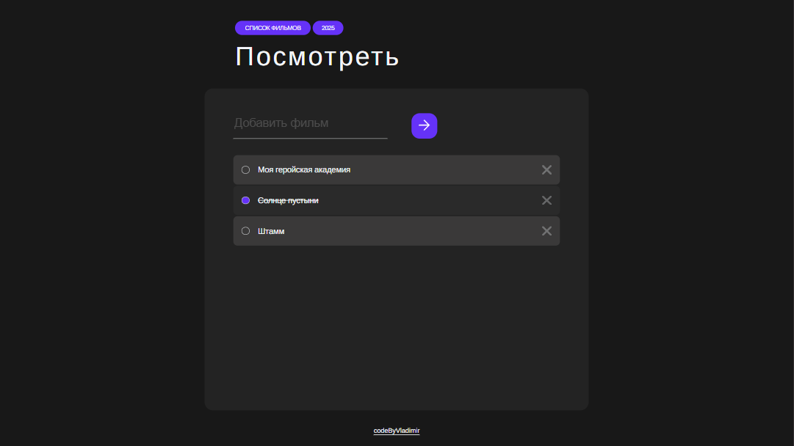
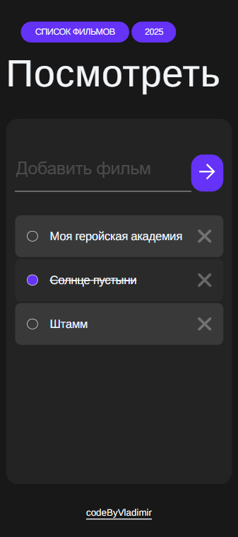

# 📽 MovieList — список фильмов

## 📌 Описание

**MovieList** — это простой веб-приложение для ведения списка фильмов. Вы можете добавлять фильмы, отмечать их как просмотренные (с изменением оформления), удалять из списка, а также всё состояние сохраняется в `localStorage` — даже после перезагрузки страницы ваши фильмы и статус просмотра сохраняются.

## 🚀 Функциональность

- Добавление фильма через текстовое поле
- Отображение фильмов в виде списка
- Отметка фильмов как просмотренных с помощью чекбокса
- Изменение оформления просмотренных фильмов
- Удаление фильмов из списка
- Сохранение списка и состояния чекбоксов в `localStorage`

## 🛠️ Технологии

- HTML
- CSS
- JavaScript (Vanilla JS)
- LocalStorage API
- Адаптивная верстка

## 📷 Скриншоты


Пример на ПК




Пример на мобильных устройствах

## ⚙️ Запуск проекта

1. Склонируйте репозиторий:
   ```bash
   git clone https://github.com/codeByVladimir/movie-list.git
   ```

2. Откройте файл `index.html` в браузере:
   ```bash
   cd movie-list
   start index.html
   ```
